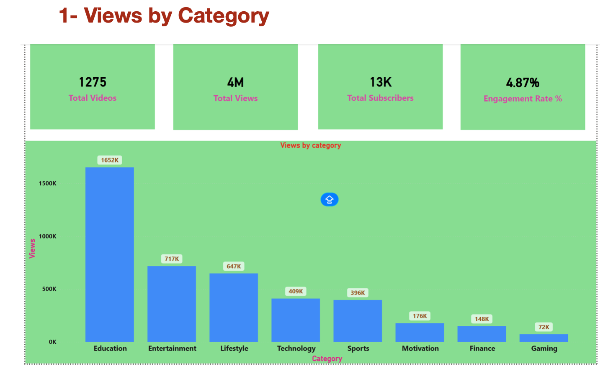
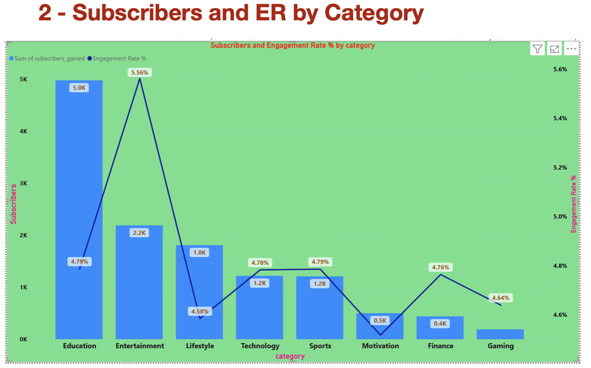
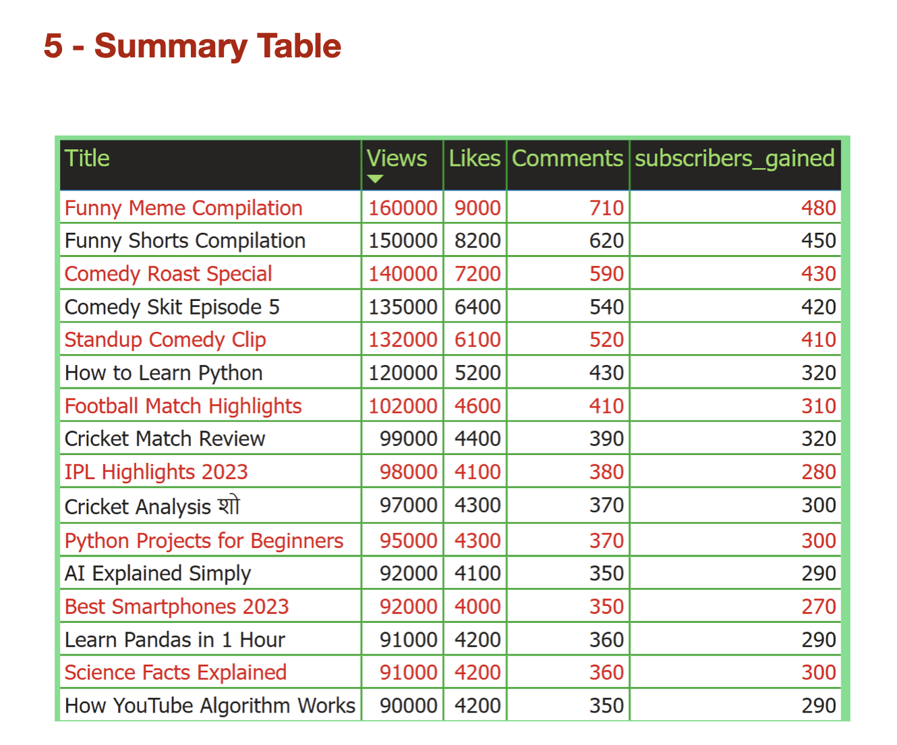
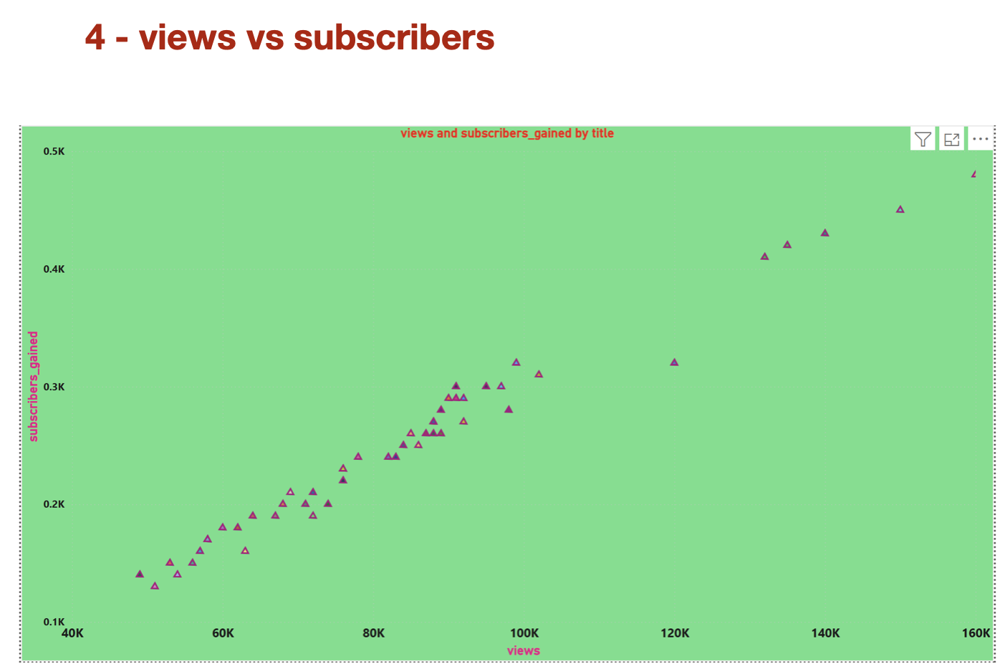
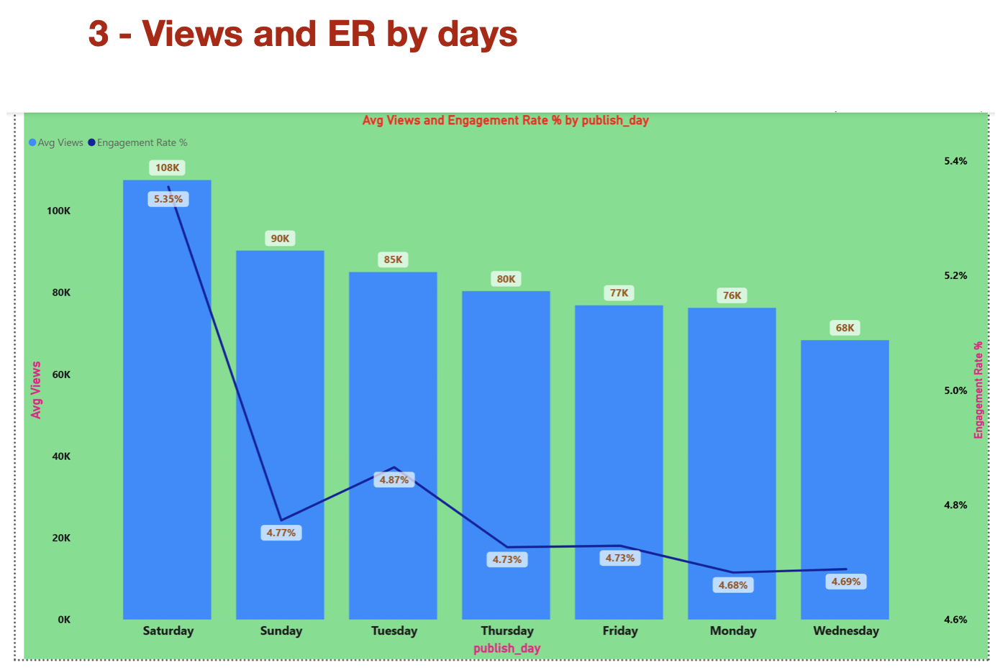

##  YouTube Content Growth Analytics

##  Project Overview

This project analyzes YouTube video performance to identify strategies that improve audience engagement and subscriber growth using Python, SQL, and Power BI.

---

##  Business Objective

• Improve subscriber conversion rate  
• Identify high-performing content categories  
• Optimize publishing schedule  
• Maximize audience engagement  

---

##  Tools & Technologies

• Python (Pandas, NumPy, Matplotlib, Seaborn)  
• SQL (SQLite)  
• Power BI  

---

##  Key KPIs Calculated

• Engagement Rate  
• Subscriber Conversion Rate  
• Watch Time Efficiency  
• Category Performance  

---

## Power BI Dashboard Preview

---

##  Business Impact

Helps content creators improve channel growth using data-driven insights.
